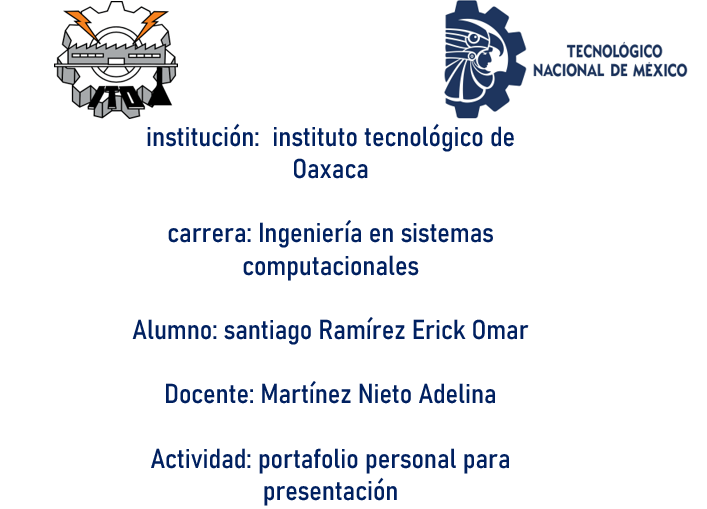
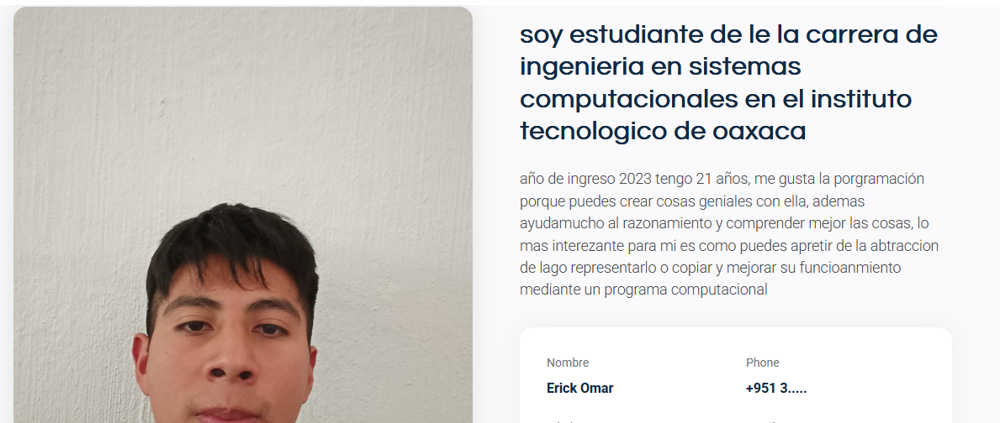
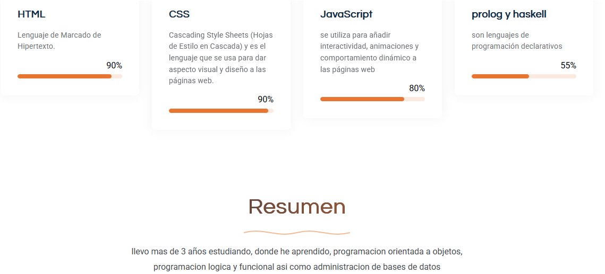
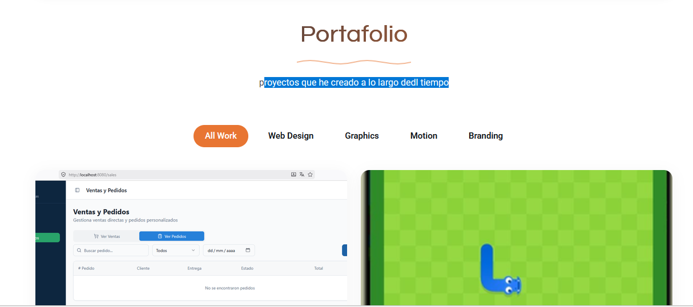

# Portafolio-Web

## informacion de la plantilla utilizada 

Template Name: EasyFolio
Template URL: https://bootstrapmade.com/easyfolio-bootstrap-portfolio-template/
Author: BootstrapMade.com
License: https://bootstrapmade.com/license/

para usar la plantilla solo tienes que abrir el enlace en el navegador, seleccionamos el boton de download y seleccionamos la opcion gratuita

Este proyecto consiste en el desarrollo de un portafolio web profesional utilizando Bootstrap 5 como framework CSS, tomando como base la plantilla DevFolio de BootstrapMade.

El objetivo fue personalizar completamente la plantilla para crear un sitio web que representara mi portafolio, personalizandolo para que contenga nuestra informacion

esta platillacuneta con el area de informacion perosna/ acerca de mí, en donde ingrese mis datos basicos , nombre y perfil asi como como las skill o tecnologias que he utilizado 

# secciones 

## acerca de mi 
 
esta seccion tiene informacion personal como quien soy y porque me gusta sistemas computacionales asi como algunas tecnologias que he usado y un resumen 

 

## Portafolio

es una seccion de proyectos que he creado se muestran las imagenes, asi como informacion de que hacen
 

en esta seccion las imagenes utilizadas se encuentran en 
assets/img/portfolio/

